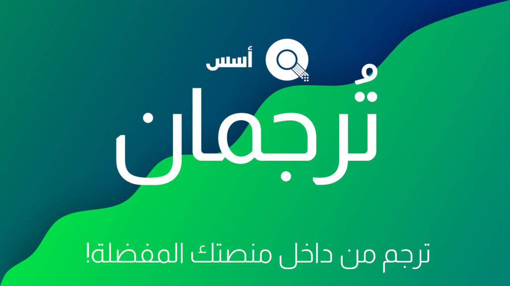

السلام عليكم

نعلن اليوم عن خطة ترجمان, احد اهم مشاريع مجتمع أسس للمساهمة في التَّرْجَمَةً و دعم اللغة العربية في البرمجيات الحرة والمفتوحة.

## ما هو تُرجمان؟

مشروع ترجمان يهدف الى جعل التَّرْجَمَةً متوفر للعامة بشكل اكثر, عبر تمكين التَّرْجَمَةً عبر منصات المستخدمين المفضلة.  
يعني امكانية تَرْجَمَة برمجيات من داخل منصات محادثة مثل Telegram او بروتوكول Matrix, او حتى موقع إلكتروني.  
يمكن لأي أحد أضافه دعم منصة جديدة لمشروع ترجمان, لأنه مصمم ليكون مرن ويحتوي على API للإضافات.

من المخطط أن ندعم Matrix, Telegram وموقع إلكتروني مستقل للترجمة.

مشروع ترجمان يهدف لتحسين تجرِبة التَّرْجَمَةً للجميع, ليس فقط لمجتمع أسس, و للغة العربية.  
وسيعمل عبر قراءة مِلَفّ, استخراج الكلمات التي تحتاج للترجمة وإرسالها للمستخدمين عبر الإضافات.  
وعند استقبال الترجمات, سيتم التعرف على الترجمات المتشابهة, تجميعها, ثم بعض استقبال عدد معين الترجمات, سيتم رفع طلب دمج(Pull Request) يحتوي على التَّرْجَمَةً و خيارات بديله لها.

ثم ينتقل الموضوع الى مشرفين المشروع / مستودع Git, لقبول او اختيار التَّرْجَمَةً البديلة.

كامل التفاصيل حول خطة المشروع موجوده في موقع تُرجمان:

[https://torjoman.aosus.dev](https://torjoman.aosus.dev)

### الترخيص

مشروع تُرجمان مرخص تحت ترخيص [AGPLv3](https://github.com/aosus/Torjoman/blob/dev/LICENSE)

## فائدة تُرجمان لمعجم أسس

أول تطبيق لتُرجمان سيكون في معجم أسس, لتنقيح المعجم بالكامل, وإكمال الكلمات الناقصة.

وبعدها سوف ننتقل لترجمة البرمجيات بعد الانتهاء من تنقيح المعجم.

## نحتاج متطوعين

مشروع ترجمان مازال خطة فقط, نحتاج لمطورين لنقوم بتطبيق هذا المشروع

اذا كنت مطور مهتم بالمساهمة بالبرمجيات الحرة, رجاءا اظهر عن اهتمامك خلال الموضوع على المجتمع.  
وهو التعليقات او من [هنا](https://discourse.aosus.org/t/topic/2498)

واذكر لغة البرمجة / المكتبة / framework التي تفضل برمجة المشروع بها.

**نحن لم نحدد اللغة البرمجية, حتى يحددها المتطوعين بنفسهم.**

مستودع Git للمشروع هنا:

[https://github.com/aosus/Torjoman](https://github.com/aosus/Torjoman)

شكرا لكم على قرائه الموضوع, ونحن نتطلع لمشاركتكم بالمشروع

### تابعنا

-   [Twitter](https://twitter.com/aosusdotorg)
-   [LinkedIn](https://www.linkedin.com/company/aosus/)
-   [Facebook](https://www.facebook.com/aosus1/)
-   [GitHub](https://github.com/aosus)
-   [Matrix](https://matrix.to/#/#aosus:aosus.org)
-   [Discord](https://discord.gg/YJUzEhU955)
-   [Telegram](https://t.me/aosus)
-   [RSS Feed](https://aosus.org/feed)
