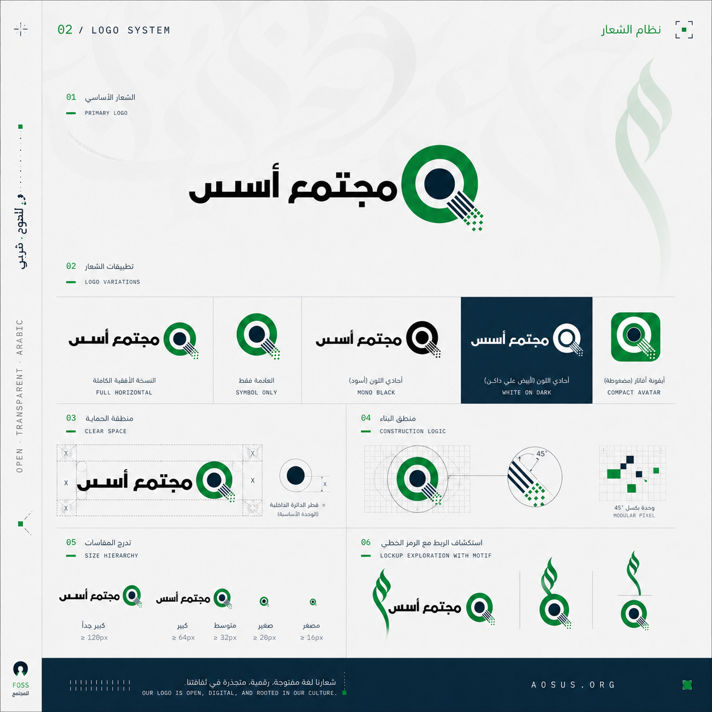
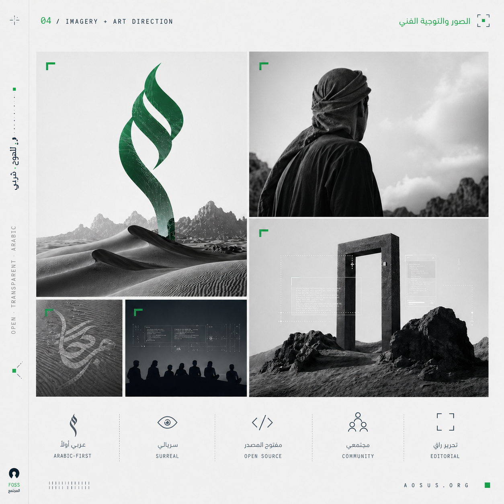
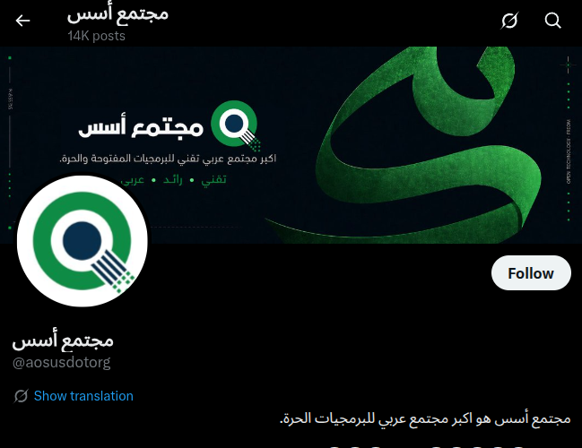
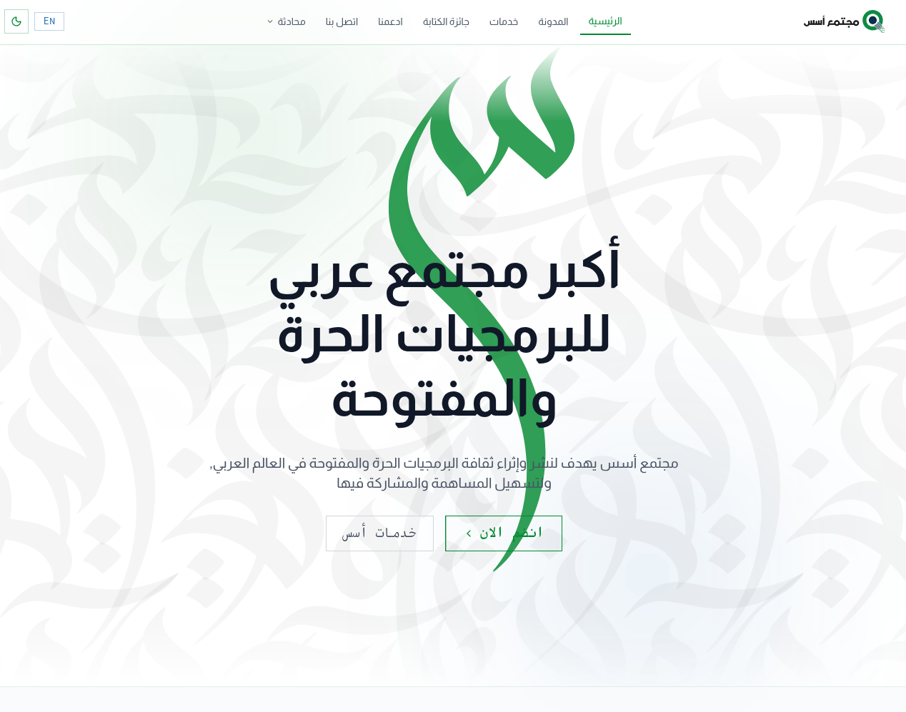
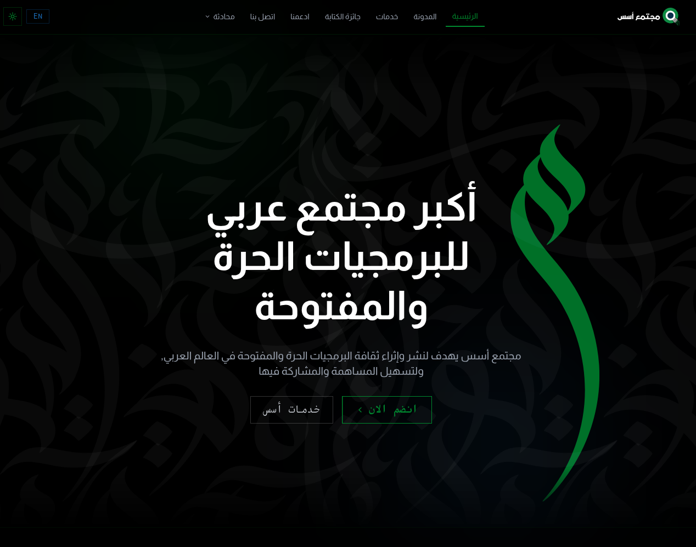
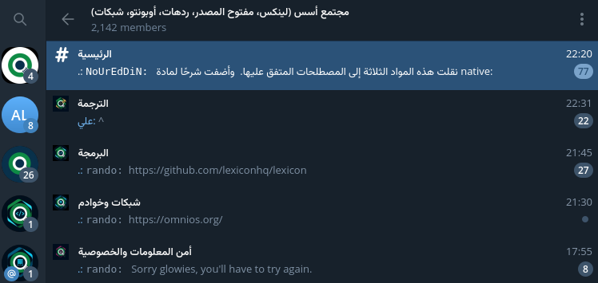

السلام عليكم ورحمة الله وبركاته، رحبوا معنا بالإصدار الثالث من مجتمع أسس.

هوية جديدة، وبداية جديدة في عصر الذكاء الاصطناعي.

## هوية مجتمع أسس الجديدة
مجتمع أسس هو مجتمع عربي، واللغة العربية هي اللغة الوحيدة التي تمتلك جمالًا خطيًا بهذا المستوى.
وهوية مجتمع أسس الجديدة تدمج جمال فن الخط العربي في كل أماكن تواجدنا.

شعار أسس الجديد

التوجه الفني لهوية مجتمع أسس.

ركزنا على أن تكون الحروف العربية جزءًا من وجود أسس على مواقع التواصل.

### موقع أسس الجديد

موقع أسس الرئيسي الجديد هو أساس هذه الهوية، وصمم بحركة تضيء الحروف العربية مع حركة الفأرة أو تلقائيًا على الهاتف.

## تضمين الذكاء الاصطناعي

لكن الإصدار الثالث من المجتمع اكثر من عبارة عن هوية وموقع جديد،  الذكاء الاصطناعي ليس فقط موضوعًا داخل أسس، بل الان جزءًا من اختصاص و تشغيل المجتمع.
خلف أسس الآن نظام ذكاء اصطناعي يساعد بإدارة البنية التحتية، ويمكنه التعامل مع الأعطال والمشاكل والصيانة بنفسه، تحت مراقبة مشرف.
لا حاجة لأن يكون هناك حاسب لحل مشكلة عطلت موقعًا. مباشرة ترسل رسالة للذكاء الاصطناعي، فيبحث عن سبب المشكلة على الخوادم ويقدم حلًا.

أيضًا نعمل على تضمين الذكاء الاصطناعي في تجارب المستخدم في منصات أسس، سواء عبر تفعيل Discourse AI لتحسين البحث، أو استخدام بوت askaosus لتجد مقالة من داخل منصة المحادثة المفضلة الخاصة بك، أو حتى لتحسين تواجد أسس على مواقع التواصل.

هذا فعلًا اختصر علينا الكثير من الوقت أثناء نقل البنية التحتية لأسس لهذا النظام الجديد.
مثلًا حصلت مشكلة أن رسائل مستخدمين من Matrix لا تصل إلى تيليجرام. عندما شرحت المشكلة للذكاء الاصطناعي، قام بالبحث، وقرأ السجلات، واستنتج أن المشكلة أن الرسائل لا تصل أساسًا. وكان السبب هو نقص إعدادات Matrix في الموقع الجديد.

بما أننا نتكلم عن Matrix، فلننتقل لأهم تغيير لتجربتكم اليومية في مجتمع أسس.

## تجربة محادثة جديدة على Telegram
 
في عام 2022، وبعد طلبات من أعضاء المجتمع، دشنا مجموعات فرعية لتخصصات متعددة.

https://aosus.org/1086

لكن تجربة المحادثات الفرعية على منصة Telegram لم تلب التوقعات، لأن اكتشاف المجموعات الفرعية من الأعضاء كان صعبًا لأنها مجموعات منفصلة.
لكن الآن أصبحت كل هذه التخصصات مدرجة تحت مجموعة مجتمع أسس الرئيسية كمواضيع (Topics)، بعد تحديث جديد لجسر Matrix ليضيف دعمها مع تعديلاتنا الخاصة.

شكرًا لكم على متابعتنا، نأمل أن يكون عملنا هذا قد نال حسن ظنكم.
انضموا لمجتمع أسس على المنصات المتوفرة وادعمونا.
