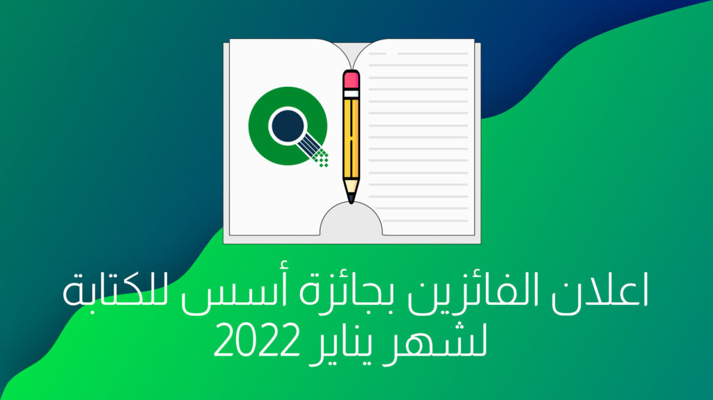

السلام عليكم ورحمة الله وبركاتة.

اول شهر في عام جديد وبداية جديدة. اليوم نعلن عن المواضيع الفائزة بجائزة أسس للكتابة في شهر يناير 2022.  
اذا لم ترى الاعلان. فجائزة أسس للكتابة, هي أول جائزة عربية تعطي جوائز مالية لكتاب محتوى حول البرمجيات الحرة والمفتوحة باللغة العربية.  
كامل التفاصيل حول المسابقة تجدها في صفحتها على موقعنا [هنا](https://aosus.org/writing-contest)

كما موضح في الموقع, كل شهر لدينا فيه 5 مواضيع فائزة وهذه المواضيع الفائزة لشهر يناير مرتبة **أبجديا**

## [ارسال email عبر الطرفية و سكريبت لإستخدام GMAIL لإرسال التقارير من سيرفر او حاسوب او راسبيري](https://discourse.aosus.org/t/topic/2257)

### الكاتب: **[Abdelilah\_Hmidani](https://discourse.aosus.org/u/Abdelilah_Hmidani)**

يتكلم عبد الله في هذا الموضوع عن طريقة ربط خدمة بريد جوجل الشهيرة, [Gmail](https://mail.google.com) بطرفية لينكس لارسال تنبيهات و اشعارات برمجيات لينكس المعتادة, مثلا استخدامها في برمجية [unattendedupgrades](https://wiki.debian.org/UnattendedUpgrades) على توزيعات الدبيانية, بحيث ترسل لك تنبيه في حاله وجود اي عطل في تثبيت التحديثات.

## [بناء مركز عمليات أمن سيبراني”SOC” بواسطة برمجيات مفتوحة المصدر؟](https://discourse.aosus.org/t/topic/2284) 

### الكاتب: **[Abo\_jamal](https://discourse.aosus.org/u/Abo_jamal)**

كتب أبو جمال موضوع مفصل عن بناء مركز عمليات امن سبراني وهو مركز يستخدم تقنيات لتحديد وتقييم حوادث الأمن السيبراني والاستجابة لها, و يذكر برمجيات مفتوحه يمكن بناء المركز عليها.

## [برنامج Session للمراسلات المجهولة / المخفية](https://discourse.aosus.org/t/topic/2240)

### الكاتب: [Abdulrhman](https://discourse.aosus.org/u/Abdulrhman)

يكتب عبد الرحمن عن برنامج Session, وهو برنامج محادثه مبني على بروتوكول سيجنل لكنه غير مركزي بالكامل. إذ يستخدم تقنيات مثل الروترات البصلية والتشفير الكامل(E2EE) لاعطاء خصوصية وامان قوي.

## [مقدمة حول توزيعة Fedora Silverblue](https://discourse.aosus.org/t/topic/2259)

### الكاتب: **[oth\_mahammedi](https://discourse.aosus.org/u/oth_mahammedi)**

يتكلم عثمان محامدي عن توزيعة [فيدورا Silverblue](https://getfedora.org/en/silverblue/), وهي توزيعه تغير فكرة طريقة عمل توزيعات لينكس المكتبيه.  
فهي تتبع نهج انظمة [اندرويد](https://android.com) و كرومOS و غيرها في جعل النظام غير قابل للتعديل. ,وفصل التطبيقات عن النظام, ,وفي حالة فيدورا سيتم ذلك باستخدام [Flatpak](https://flatpak.org) وحاويات لينكس/OCI(docker) بحيث يبقى النظام غير معدل قابل للاستبدال وثابت للغاية.

## [توزيعة EndeavourOS ميزات، كيفية التثبيت ومابعد التثبيت](https://discourse.aosus.org/t/topic/2276)

### الكاتب: **[oth\_mahammedi](https://discourse.aosus.org/u/oth_mahammedi)**

يفوز عثمان مرة أخرى, وهذه المرة في موضوع مفصل عن توزيعة EndavourOS المجتمعية, وهي توزيعة جديدة أذ تم انشائها في 2019 وهي مبنيه على توزيعة أرش الشهيرة مع تقديم مثبت رسومي و العديد من المزايا الاخرى.

جميع هذه المواضيع سيتم رفعها لمدونة [Gnulinuxsa.org](https://Gnulinuxsa.org) خلال هذا الشهر.  
مدونة [gnulinuxsa.org](https://gnulinuxsa.org) هي مدونة تبنتها أسس هدفها نشر البرمجيات الحرة والمفتوحة بالعالم العربي.  
  
كل عام وانتم بخير شكرا لكم على متابعتكم, وشكرا لراعي المسابقة سالم يسلم.
