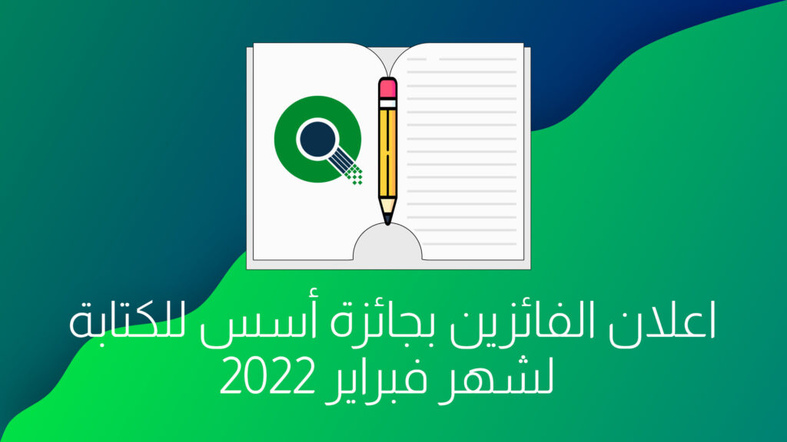

السلام عليكم ورحمة الله وبركاتة

شهر جديد وفائزين جدد، نعلن اليوم عن الفائزين لشهر فبراير 2022 في جائزة أسس للكتابة

اذا لم تر ألإعلان. فجائزة أسس للكتابة, هي أول جائزة عربية تعطي جوائز مالية لكتاب محتوى حول البرمجيات الحرة والمفتوحة باللغة العربية.  
كامل التفاصيل حول المسابقة تجدها في صفحتها على موقعنا [هنا](https://aosus.org/writing-contest)

## المواضيع الفائزة

هذه المواضيع الفائزة لشهر فبراير 2022 مرتبة **أبجديا**

### [برامج تحرير المساحة وتنظيف الجهاز في لينُكس](https://discourse.aosus.org/t/topic/2315)

الكاتب: **[islamux](https://discourse.aosus.org/u/islamux)**

يتكلم **[islamux](https://discourse.aosus.org/u/islamux)** عن برامج لتحرير المساحة المستخدمة و تنظيف الحاسب في توزيعات لينكس

### [طريقة سهلة لمشاركة الملفات باستخدام Caddy](https://discourse.aosus.org/t/topic/2298)

الكاتب: [Abady](https://discourse.aosus.org/u/Abady)

يشرح [Abady](https://discourse.aosus.org/u/Abady) في هذا الموضوع عن كيفية مشاركة الملفات باستخدام خادم الويب الجديد Caddy, المشهور بسهولة أستخدامه و تأمينه الافتراضي للمواقع عبر اصدار شهادات TLS تِلْقائيًا

### [كيفية إدارة حاويات Toolbox في توزيعة Fedora Silverblue](https://discourse.aosus.org/t/topic/2307)

الكاتب: [oth\_mahammedi](https://discourse.aosus.org/u/oth_mahammedi)

يكتب [oth\_mahammedi](https://discourse.aosus.org/u/oth_mahammedi) في هذا الموضوع عن برمجية Toolbox لإدارة ألأنظمة داخل حاويات داخل توزيعة Fedora Silverblue.

### [كيفية تغير لغة الحزمة المكتبية Libre Office و اضافة مدقق لغوي](https://discourse.aosus.org/t/topic/2300)

الكاتب: [Abdelilah\_Hmidani](https://discourse.aosus.org/u/Abdelilah_Hmidani)

يكتب [Abdelilah\_Hmidani](https://discourse.aosus.org/u/Abdelilah_Hmidani) في هذا الموضوع عن كيفية تغيير لغة الحُزْمَة المكتبية الشهرية LibreOffice وكيفية اضافة مدقق لغوي لها.

جميع هذه المواضيع سيتم رفعها لمدونة [Gnulinuxsa.org](https://gnulinuxsa.org/) خلال هذا الشهر.  
مدونة [gnulinuxsa.org](https://gnulinuxsa.org/) هي مدونة تبنتها أسس هدفها نشر البرمجيات الحرة والمفتوحة بالعالم العربي.  
  
شكرا لكم على مشاركاتكم و متابعتكم, وشكرا لراعي المسابقة سالم يسلم.
