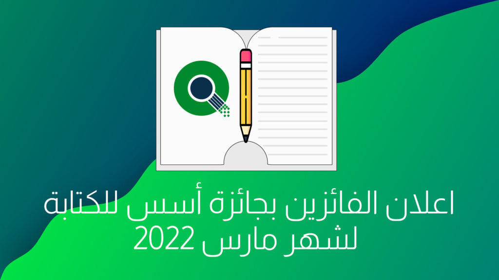

السلام عليكم ورحمة الله وبركاتة

رمضان مبارك! وكل عام وانتم بخير, نعلن اليوم عن الفائزين لشهر مارس 2022 في جائزة أسس للكتابة

اذا لم تر ألإعلان. فجائزة أسس للكتابة, هي أول جائزة عربية تعطي جوائز مالية لكتاب محتوى حول البرمجيات الحرة والمفتوحة باللغة العربية.  
كامل التفاصيل حول المسابقة تجدها في صفحتها على موقعنا [هنا](https://aosus.org/writing-contest)

## المواضيع الفائزة

هذه المواضيع الفائزة لشهر مارس 2022 مرتبة **هجائيا**

## [توقيع الموثوقية في GitHub](https://discourse.aosus.org/t/topic/2375)

الكاتب: [TheAwiteb](https://discourse.aosus.org/u/TheAwiteb)

يتكلم عويتب عن مفاتيح GPG/PGP وكيفية استخدامة لتوقيع التعديلات على منصة Github للتاكد من هويتك,  
وتجنب التنكر باسم حسابك عبر استخدام بريدك واسم المستخدم في Git دون اي حماية اضافية.

## [دالة إذا الشرطية في حزمة ليبر اوفيس المكتبية](https://discourse.aosus.org/t/topic/2391)

الكاتب: [X-Ahmad](https://discourse.aosus.org/u/X-Ahmad)

يفوز احمد بجائزة أسس بموضوع شيق يتكلم عن استخدام دالة إذا الشرطية(If) في ليبر اوفيس, اشهر حزمة مكتبية حرة. ويقوم باستخدامها كمثال لتنجيح الطلاب اذا كانت درجاتهم اعلى من 50.

## [طريقة الإتصال بشبكة WiFi باستخدام سطر الأوامر في لينكس](https://discourse.aosus.org/t/topic/2379)

الكاتب:[خالد (lnx0](https://discourse.aosus.org/u/lnx0))

يشرح خالد كيفية الاتصال بشبكة Wi-Fi عبر سطر الاوامر في لينكس عبر اداة nmcli

## [كيفية إدارة نظام قائم على rpm-ostree توزيعتي Silverblue و Kinoite على سبيل المثال](https://discourse.aosus.org/t/topic/2387)

الكاتب: **[عثمان محامدي](https://discourse.aosus.org/u/oth_mahammedi)** [(oth\_mahammedi](https://discourse.aosus.org/u/oth_mahammedi))

يفوز عثمان محامدي بموضوع يتكلم عن ادارة الحزم التقليدية على التوزيعات التي تستخدم Rpm-ostree وهي توزيعات فيدورا الغير قابله للتعديل خارج /home, لتعطي ثبات اعلى من التوزيعات المعتادة

## [ماهو PATH وكيف يستخدم في لينُكس؟](https://discourse.aosus.org/t/topic/2370)

الكاتب: **[Fatehi](https://discourse.aosus.org/u/islamux)** [(](https://discourse.aosus.org/u/islamux)[islamux](https://discourse.aosus.org/u/islamux))

يكتب فتحي عن احد اهم المتغيرات في عالم لينكس وهو $PATH وما هو وما استخداماته داخل توزيعات لينكس.

جميع هذه المواضيع سيتم رفعها لمدونة [Gnulinuxsa.org](https://gnulinuxsa.org/) خلال هذا الشهر.  
مدونة [gnulinuxsa.org](https://gnulinuxsa.org/) هي مدونة تبنتها أسس هدفها نشر البرمجيات الحرة والمفتوحة بالعالم العربي.

شكرا لكم على مشاركاتكم و متابعتكم, وشكرا لراعي المسابقة سالم يسلم. وكل عام وانتم بخير.
