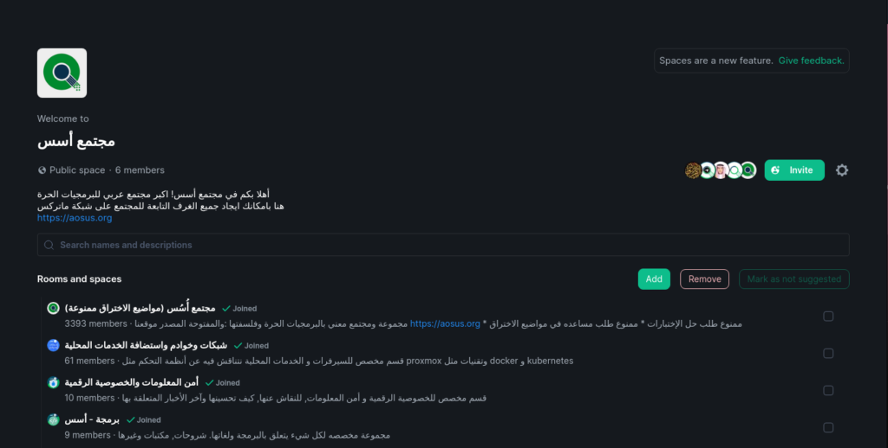

السلام عليكم ورحمة الله وبركاتة.

خلال الفترة الماضيه وصلتنا طلبات بانشاء غرف فرعيه لها تخصص محدد, وذلك بسبب ان الغرفة الرئيسية تتنوع فيها المحادثات وقد يصعب ايجاد محادثات عن موضوع معين.

اليوم نعلن عن افتتاح غرف فرعية. وهي متوفرة على شبكة [Matrix](https://discourse.aosus.org/t/topic/1658) و منصة [Telegram](https://telegram.com).  
وهذه الغرف مربوطه بالاقسام المناسبة بالمجتمع, لنبقيكم على تحديث باخر المواضيع التي تناسب تخصص الغرفة

## الغرف:

-   خوادم و شبكات وأستضافة الخدمات المحلية
-   أمن المعلومات و الخصوصية الرقمية
-   برمجة

### Matrix

الغرف جميعها موجوده على ماتركس داخل aosus space, وهو بعنوان #aosus:aosus.org او رابط مباشر من [هنا](https://matrix.to/#/#aosus:aosus.org)

### Telegram

-   [خوادم و شبكات وأستضافة الخدمات المحلية](https://t.me/networksAndServers)
-   [أمن المعلومات و الخصوصية الرقمية](https://t.me/aosus_privacy_security)
-   [برمجة](https://t.me/aosus_programming)

شكرا لكم على المتابعة, ونحن بانتظار مشاركاتم في غرف المحادثة
