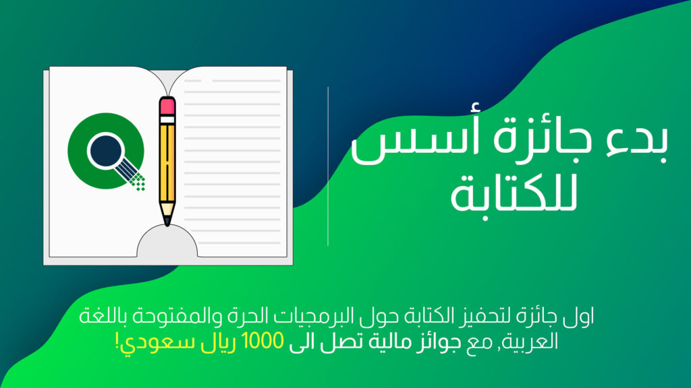

السلام عليكم ورحمة الله وبركاتة.

نعلن اليوم عن بدء جائزة أسٌس للكتابة، وهي اول جائزة من نوعها بالعالم العربي.  
جائزة أسس للكتابة, جائزة شهرية لتحفيز كتابة محتوى حول البرمجيات الحرة والمفتوحة باللغة العربية.  
ولها جوائز مالية تصل الى 1000 ريال سعودي! برعاية [سالم يسلم](https://sy.sa).

طريقة المشاركة بالمسابقة سهلة وبسيطة، أكتب موضوع على [مجتمع أسس](https://discourse.aosus.org) حسب شروط المجتمع و شروط المسابقة وهي موضحه في [صفحه المسابقة](https://aosus.org/writing-contest) على الموقع.

في نهايه كل شهر سيتم اختيار 5 فائزين, سيتم التواصل معهم عبر الرسائل الخاصة على الموقع, لذلك تاكد من تاكيد حسابك وأن عنوان البريد اﻹلكتروني الخاص بك فعّال حتى يصلك تنبيه وصول الرسالة.  
بعد ذلك, سيتم نقل المواضيع الفائزة الى مدونة [Gnulinuxsa.org](https://gnulinuxsa.org), وهي مدونه عربيه شهيرة تتحدث عن لينكس والبرمجيات الحرة.

## استلام الجائزة

سيتم تحويل المبلغ المالي عبر منصة [PayPal](https://paypal.com) الشهيرة, لذلك لاستلام الجائزة ستحتاج أن يكون لديك حساب فعّال على المنصه. سيتم السؤال عن تفاصيل حسابك عبر الرسائل الخاصة. **في حالة عدم وجود حساب paypal, سيتم التواصل مع الفائز لتحديد وسيلة اخرى.**

شكرا لكم على متابعتكم لنا, ونحن بانتظار مشاركاتكم.

[شارك في المسابقة](https://discourse.aosus.org)
