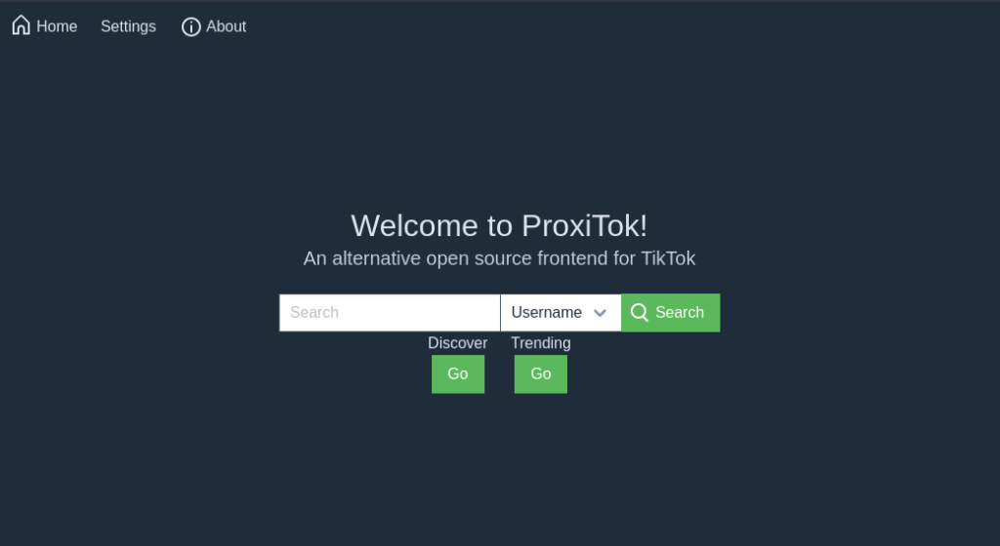
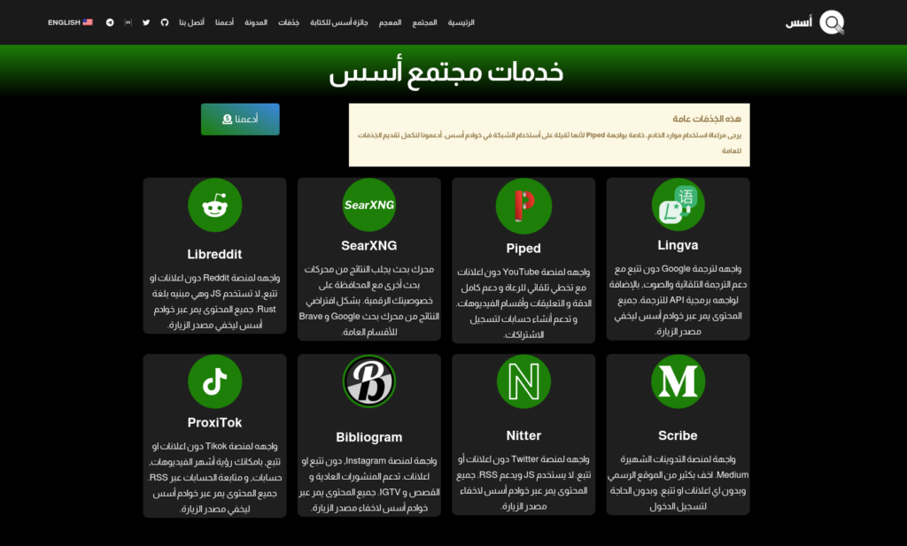
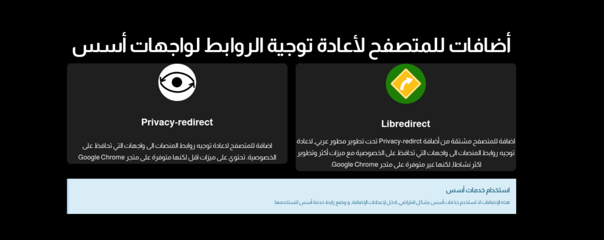

السلام عليكم ورحمة الله وبركاتة

في الشهر فبراير الماضي, اعلنا عن [افتتاح خِدْمَات مجتمع أسس](https://aosus.org/1105), وهي مجموعة من الواجهات لخدمات شهيرة مثل YouTube و Reddit و Instagram وغيرها, تمكنك من مشاهدة المحتوى دون تتبع, عبر تمرير الاتصالات عبر خوادم أسس, او عبر تحميل فقط المحتوى المطلوب من الخدمة.

وإلان نحدثكم عن اخر التغييرات لخدمات مجتمع أسس

## أضافه Proxitok

نظرا لانتشار منصة Tiktok, وزيادة المحتوى القصير عليها حول اي موضوع منها البرمجيات الحرة والمفتوحة, قمنا بإضافة واجهه Proxitok لتمكنكم من مشاهدة المحتوى دون التضحيه بخصوصية.

بإمكانك تصفح صفحة الفيديوهات الأشهر او صفحة الاكتشاف “discover” بالإضافة الى أمكانية التوجه مباشرة لحساب او فيديو او موسيقى معينة.

[واجهة Proxitok](https://proxitok.aosus.org)

واجهة Proxitok

## صفحة خِدْمَات مجتمع أسس الجديدة

الصفحة السابقة لخدمات أسس كانت تستخدم برمجية Homer, وهي لا تدعم العربية جيدا, وهناك حد معين لحجم الوصف.  
لذلك الصفحة السابقة لم تكفي بالغرض, ولم توضح وظيفة كل خدمة.

لذلك قمنا بتصميم صفحة جديدة لخدمات مجتمع أسس, تدعم العربية بطريقة افضل, وأسهل للمستخدمين.  
بالإضافة لترتيب يناسب الهواتف الذكية والشاشات الطولية اكثر.

الصفحة الآن هي جزء من الموقع الرئيسي, بدلا من ان يكون لها عنوان مستقل, العنوان السابق تم إيقافه واستبداله بالصفحة الجديدة.

هناك قسم أيضا توجد فيه تفاصيل حول الإضافات التي تقوم بإعادة توجيه الروابط لواجهات أسس.  
وتوضيح الفرق بين الخيارين, أضافه Libredirect هي الأفضل, لكن بسبب تغييرات سياسة Chromium الحديثة, وتجهيز لتوقيف Manifest V2, لم يستطع صاحب الإضافة أضافتها لمتجر كروم.

## استضافة جديدة لخدمات مجتمع أسس

تم تغيير استضافة الخِدْمَات الى استضافة جديدة, تقدم سرعة افضل للمنطقة العربية مع سرعة أنترنت اعلى.

شكرا لكم على المتابعة, ونتمنى أن تساعدكم خِدْمَات أسس بحماية خصوصيتكم.  
لدعم استمرار الخِدْمَات, بإمكانك دعم مجتمع أسس عبر منصة Open Collective

[أدعم مجتمع أسس](https://opencollective.com/aosus)
