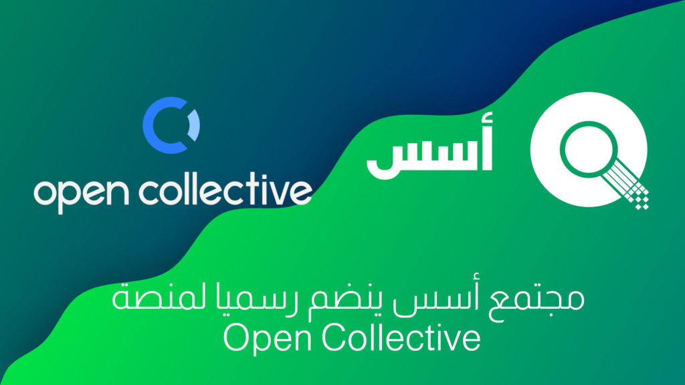
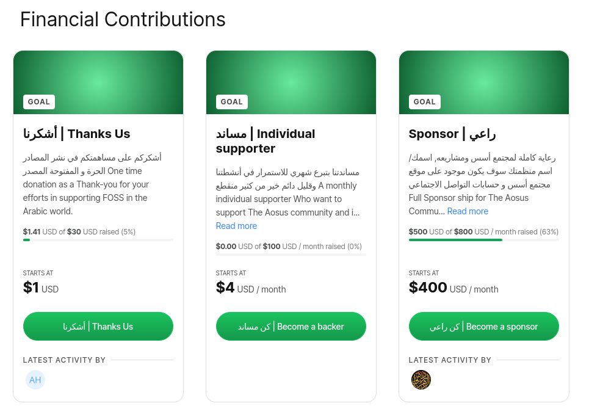
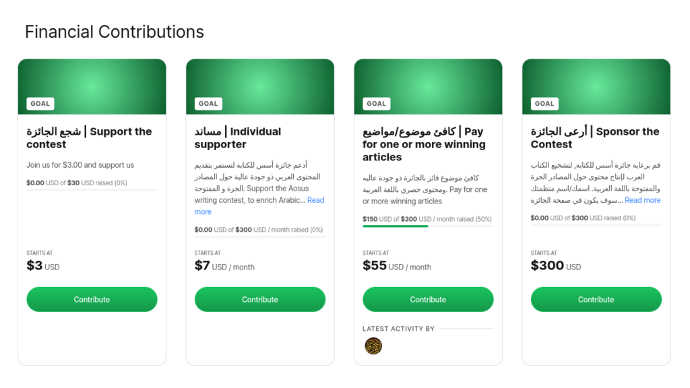

السلام عليكم ورحمة الله وبركاتة.

أخيرا, بعد عمل طويل في الكواليس, نعلن اليوم عن انضمام مجتمع أسس بشكل رسمي لمنصة Open Collective!

منصة Open Collective هي منصة مالية ذو شفافية عاليه, تمكن المجتمعات, البرمجيات و غيرها من التجمعات من ادارة الموارد المالية بشفافية عاليه وسهولة.  
و يعد مجتمع أسس أحد اوائل المشاريع العربية التي تنضم للمنصة.

انضمامنا للمنصة سوف يمكننا من الحصول على الاستقلالية المالية, دون الاعتماد على شخص او فرد معين, ف Open Collective هي منصة مستقله عن المشروع, تمكننا من الدفع او استقبال التبرعات, وأيضا سيكون هناك شفافية كامله في كامل التكاليف, بحيث كل العمليات المالية سوف تظهر على صفحة المجتمع.  
عند دعمكم لمجتمع أسس سيتم شكركم بتغريده على حساب المجتمع على منصة Twitter, مع وضع حسابك اذا ربطة بالمنصة!.

## تغييرات على جائزة أسس للكتابة

بما ان اصبحت منصة Open Collective هي المنصة التي ستكون بها كل المعاملات الماليه للمجتمع, ستكون الجوائز ايضا على المنصة نفسها.  
وهي **تدعم Paypal و حوالات بنكية في [دول محدودة](https://wise.com/help/articles/2571942/what-countries-can-i-send-to)**

كامل التفاصيل على [صفحة الجائزة](https://aosus.org/writing-contest)

## دعم مجتمع أسس

بإمكانكم الان دعم مجتمع على Open Collective, لدينا عدة مستويات من الدعم لتناسب هدف تبرعك لنا

### أشكرنا

تبرع مرة واحدة بقيمة بسيطة(يمكن زيادتها), كشكر لنشاط وعمل فريق المجتمع

### مساند

تبرع شهري بقيمة تبدء من 4$ بالشهر, لمساعدتنا في الاستمرار في عملنا وانشطتنا في المجتمع, فدائما قليل دائم افضل من كثير منقطع.  

### راعي

اذا كنت منظمة او جهه او حتى شخص تريد ان تشجع و تدفع المجتمع الى المرحلة التالية في العطاء والتطوير, بامكانك رعاية المجتمع بالكامل, وسيتم وضع اسم الجهة/المنظمة/الشخص على موقع مجتمع أسس والحسابات التابعة لمجتمع أسس على مواقع التواصل

## دعم جائزة أسس للكتابة

جائزة أسس للكتابة هي احد اكبر الأشياء المكلفة في انشطة مجتمع أسس, والآن اصبح بإمكانكم دعم الجائزة على منصة Open Collective

### شجع الجائزة

تبرع بسيط لتشجيع فريق أسس للإكمال في الجائزة, مرة واحدة ويبدأ من 3$ ويمكن تعديل القيمة.

### مساند

تبرع شهري يبدء من 7$ لدعم أستمرار الجائزة, دائما قليل دائم افضل من كثير منقطع.

### كافئ موضوع/مواضيع

بإمكانك مكافئة موضوع او عدة مواضيع, تم تقسيم الأسعار المقترحة لتناسب عدد المواضيع.  
التبرع شهري ويمكن تعديل المدة.

### أرعى الجائزة

رعاية كاملة لجائزة أسس للكتابة, سيتم وضع اسم الراعي على موقع الجائزة, وكامل الإعلانات المتعلقة بالجائزة على مواقع التواصل.

شكرا لكم على دعمكم ومتابعتكم لنا, هذه تعتبر نقلة كبيره في المشروع, فهي تمكننا من الحصول على شفافية مالية واستقلاليه عالية بسبب انضمامنا للمنصة, ونحن نشكر المنصة و المستضيف المالي Open Source Collective على موافقتهم على انضمام مجتمع أسس.
